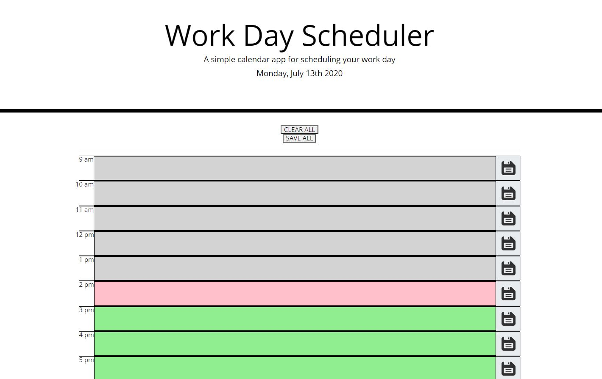
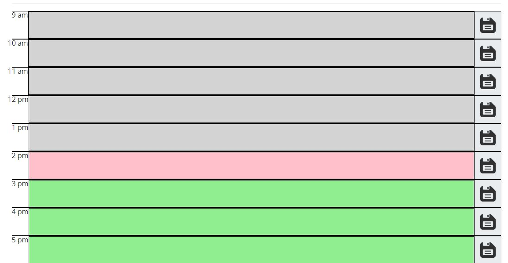
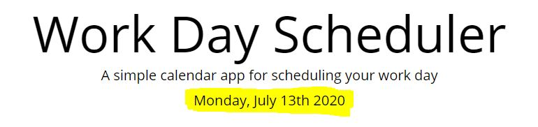

# Work Day Scheduler
UCI Boot Camp Homework 05 - Work Day Scheduler

This was the fifth homework assignment for the full stack web development program at UC Irvine, in which the goal was to build a Work Day Scheduler where the user can enter in events and those events are saved to the local storage. 

# Link to Deployed Application:
https://maxx105.github.io/work_day_planner/

# Image of Deployed Application:

# Technologies:
I used HTML and CSS for the front end as well as Bootstrap for styling. I used the moment.js library (https://momentjs.com/) to retrieve time and dates. The script is done with Javascript.

# How to use: 
The planner shows text boxes for each hour of a 9-5 work day. Those text boxes are grey if the corresponding hours have passed, is red if that is the current hour and are green if that hour has yet to come. See screenshot of this taken a 2:30pm:

You can click inside any box, and start typing an event. Then press the corresponding save button and it will save it to the local storage so the information will stay if the page is refreshed.

Additionally, there is a "CLEAR ALL" and a "SAVE ALL" button at the top which clear all entered text (including FROM local storage) and save all entered events (including TO local storage), respectively.

# How it Works:
This is a rather simple application that exploits the moment.js library for time and dates. It first displays the current day of the week and date which uses the moment.js format, 'dddd, MMMM Do YYYY'. 

Using html/css with the help of bootstrap, I created 9 text boxes with a button appended after each one with each surrounded by top and bottom borders. I then created one large for loop that iterates between 9 and 17 (9am to 5pm) with the rest of the code within that for loop.

There are three parts to the for loop: the get local storage element, the set local storage element, and the element that determines the color change depending on the current hour.

The get local storage iterates through all the keys created by the set local storage element. The set local storage element creates keys and values for each hour using a nested for loop. Lastly, there is some logic that basically takes the current hour (moment().format('H')) using a 24 hour format and uses that to determine which color each text box is (lightgrey, lightgreen, or pink).

